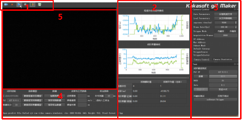

# 激光焊接成形质量检测软件

该软件是基于[FastVideo](https://github.com/hao-ai-lab/FastVideo)二次开发而成，主要利用了该项目中的相机API接口封装，界面结构。图像处理于分析部分由[video_pipeline](https://github.com/weinaike/video_pipeline)替代，将图像ISP处理与模型分析基础到一套框架下。该软件主要实现分析结果显示与用户交互部分。

## 界面

界面布局

1. 工具栏
2. 检测分析结果
3. 相机控制与ISP处理参数
4. 分析模型选择与闭环控制参数
5. 实时图像显示区

功能支持：

1. 熔深检测
2. 熔透识别
3. 成形稳定性识别
